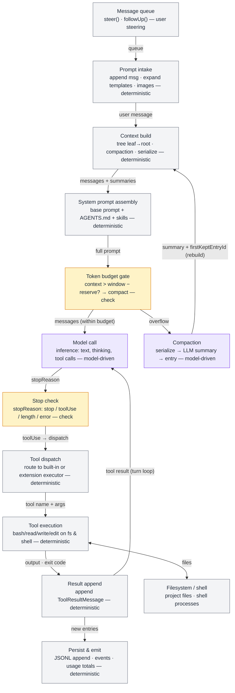

# Pi Harness — AgentSession Turn Loop

Zoom into the single most complex component: the `AgentSession` turn loop
(one user prompt → one or more model calls → tool executions → persistence).

Color legend (same as `pi-harness-overview.md`):

- **gray** = deterministic script, file, or config
- **purple** = model call (inferential judgment)
- **amber** = gate / guard / check

## Feedback loops

1. **Turn loop** — `result → model`: tool output feeds the next inference call
   until `stopReason` is `stop`.
2. **Compaction recovery** — `gate → compaction → context`: on context
   overflow the old span is summarized and the context is rebuilt before the
   aborted turn is retried.
3. **User steering** — `queue → intake`: `steer()`/`followUp()` messages are
   delivered at the next turn boundary.

Each step is labeled deterministic vs model-driven in its subtitle; only
**Model call** and **Compaction** are model-driven (purple).
