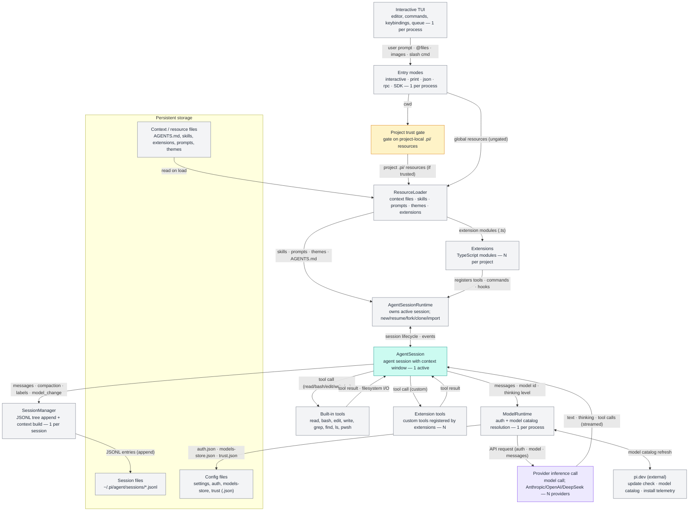

# Pi Harness — Architecture Overview

End-to-end view of the pi coding-agent harness (v0.84.3), derived from the
package `README.md`, `docs/` (sdk, compaction, session-format), and `dist/`.

## Assumptions

1. **"The harness" = pi itself** — the coding agent CLI, built on `pi-ai`
   (models), `pi-agent-core` (agent), `pi-tui` (UI), `pi-client`, and
   `pi-protocol`.
2. **Trust gates only project-local resources** (`.pi/`); global resources flow
   in ungated. Both paths are drawn.
3. **Cardinality:** one process → one active `AgentSession` (replaced, never
   concurrent); one model call in flight per turn; N providers/models; N
   extensions/tools.
4. **"Model call" = provider inference** (including the compaction/branch
   summarizer). `ModelRuntime` itself is deterministic orchestration
   (auth + catalog resolution), so it is not marked as a model call.
5. Tools shown as the default set (`read`, `bash`, `edit`, `write`, `grep`,
   `find`, `ls`, `powershell`) plus extension-registered tools.

## Diagram 1 — Overview

## Color legend

- **gray** = deterministic script, file, or config
- **purple** = model call (inferential judgment)
- **teal** = agent session with its own context window
- **amber** = gate / guard / check

## Analysis

Across both diagrams there are **3 purple model-call boxes** (per-turn
inference plus the compaction summarizer) against **22 gray deterministic
boxes** and **3 amber gates** — roughly 1 model call for every 7 deterministic
steps. Cost is therefore confined to those few inference hops even though the
model drives the entire loop; every billed token flows through a purple box.
Reliability risk concentrates exactly there: the provider call is the only
component that can stream partial output, error, or stall, and its failure
path (auto-retry + compaction overflow recovery) is the second-most complex
region. The deterministic plumbing is cheap and frequent but merely amplifies
whatever the model decides, so a bad tool call costs far more to recover from
than a bad summary. In practice, failures cluster at the model-call boundary
and the compaction/overflow loop, not in file I/O or persistence.
